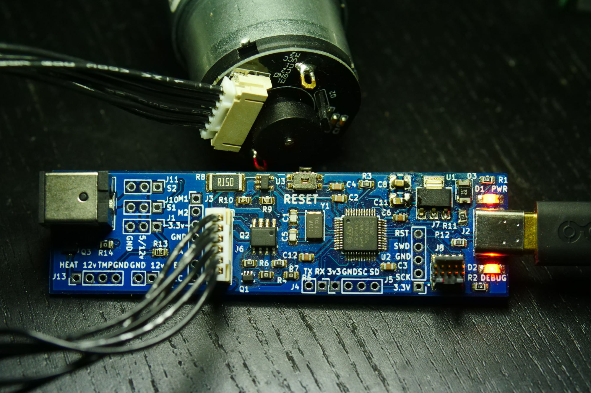
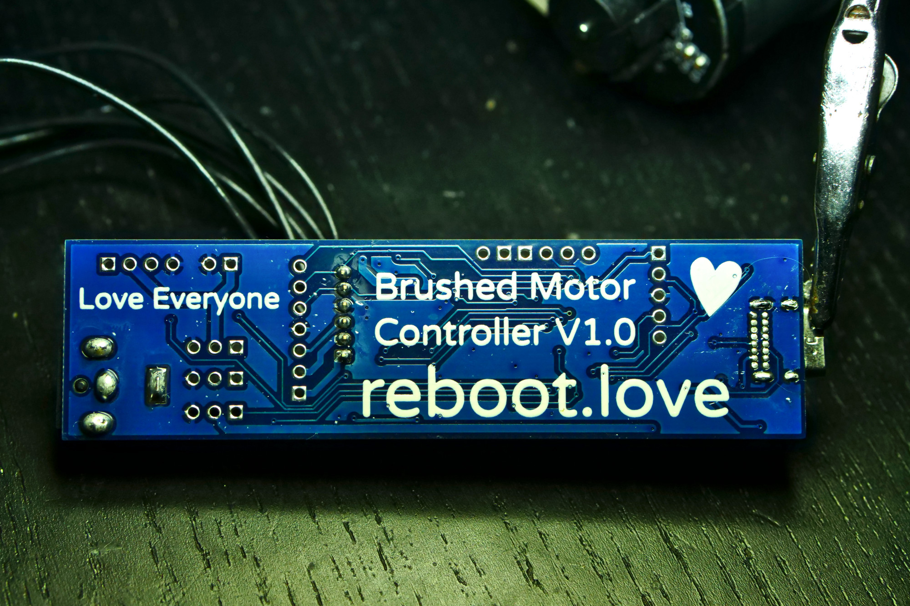

Brushed Motor Controller by Taylor Alexander from reboot.love

NOTICE: I would love it if someone wanted to manufacture these for their own profit. I have licensed everything CC0 which means I release all rights. I just want someone to make these! The current design works but can be improved. If anyone wants to produce these, please email me and we can collaborate on improving the design.

Purpose:

There are lots of low cost (under $10) brushed gear motors with encoders on Aliexpress and Amazon. This board is designed to precisely drive those motors, using encoder feedback and current measurement for precise positioning, velocity, and current control.

Possible improvements:
Q1 is a little small physically.
Form factor could be improved.
J1, J10, J11 could be removed, along with Q3.
Should check motor pinouts and compare to common motors.

License Notes:
This board is heavily modified from David Grubb's Jaguar-USB-tap.
https://github.com/dgrubb/Jaguar-USB-tap
That board has a GPL license. When I emailed David for permission to relicense as CC0, he replied "I don't think you need my permission."
So I am relicensing CC0 as I tend to prefer that type of license. If you have any concerns over licensing, contact David Grubb or consider following the more restrictive GPL V3.0 License (meaning: share your modifications and everything will be fine).
